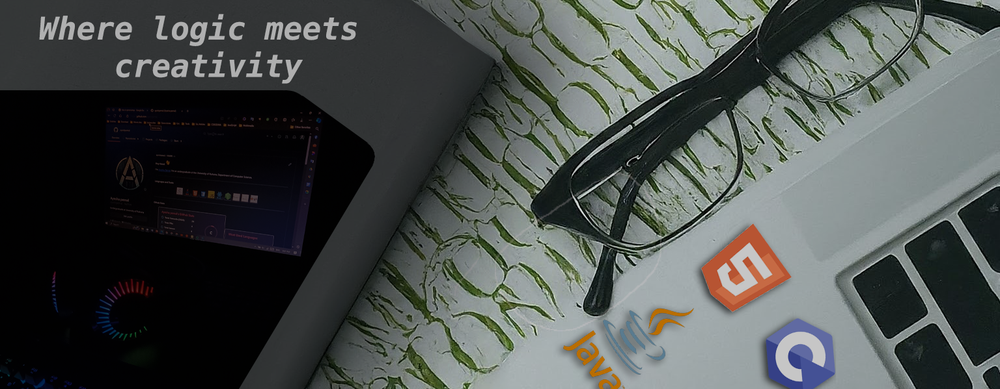

  

<h2 align="center">
  Hey there!  I'm Ayesha Senarath
</h2>

  <b>Software Engineer</b> &bull; <b> (University of Ruhuna)</b>

  Software Engineer with hands-on experience building full-stack web applications, robust backend APIs, AI-powered features, and automated data-processing workflows. Experienced with <b>React, NestJS, Spring Boot, Supabase, PostgreSQL, Docker,</b> and <b>AWS</b>. Skilled in building intelligent systems using OpenAI, Supabase embeddings, speech-to-text APIs, database security (RLS), and CI/CD pipelines.

---

### 🛠️ Languages & Technologies

  <b>Languages:</b> 
  
  
  
  
  
  

  <b>Frameworks & Backend:</b> 
  
  
  
  
  
  
  

  <b>Cloud, DevOps & Databases:</b> 
  
  
  
  
  
  

<!-- 

  <b>AI & Integrations:</b> 
  
  
  

 -->

---

### 📊 GitHub Stats

<!-- 

  
  

 -->

  

---

### 📫 Connect with Me

  
  
  

